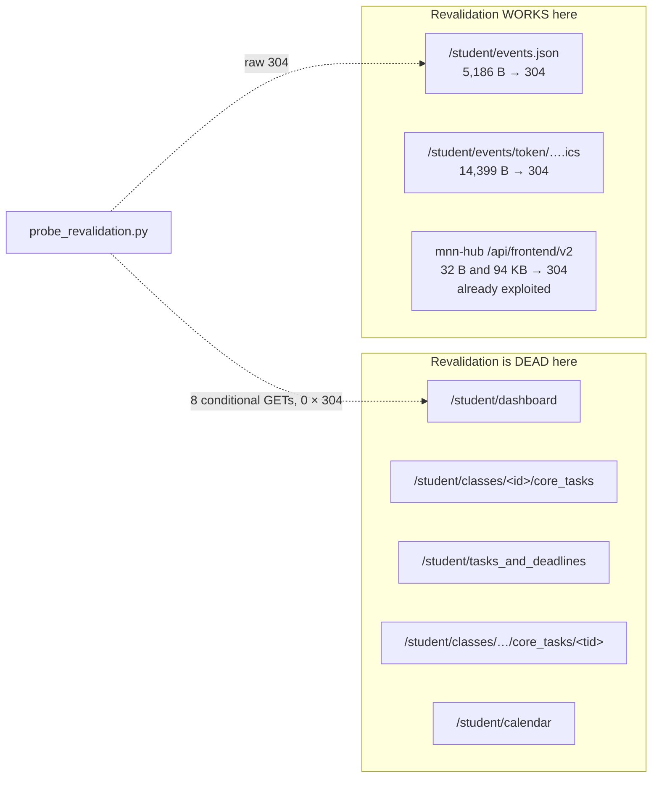

# HTTP revalidation: what the ETag can and cannot do

Written 2026-09-20. Every claim below was measured against a live `.cn`
account with the probe in `extras/`. No password was used and no state was
written. The school subdomain is deliberately not named here, since this file
ships in the sdist.

## The question

ManageBac already answers `If-None-Match` with `304` on some endpoints, and
`MNNHubClient` exploits that on the notification hub. Does the same work on the
pages that actually cost bandwidth — the task lists and grade pages — or is
server-side revalidation a dead end there?

## Answer

**The server's `ETag` is worthless on every Rails-rendered HTML page, and that
is structural rather than a configuration problem. It works, and is worth
adopting, on exactly two endpoints — both JSON/ICS, both cheap, both currently
unexploited.**

The reason the HTML pages can never answer `304` is in the next section, and it
is not something the client can work around by sending the header differently.

## What the server actually sends

Measured on every response, GET and conditional alike:

| Header | Value |
|---|---|
| `Cache-Control` | `max-age=0, private, must-revalidate` |
| `ETag` | present, weak, always `W/"<32 hex>"` |
| `Last-Modified` | **absent** |
| `Expires` / `Pragma` / `Age` | absent |
| `Vary` | `Accept, Origin` |
| `Set-Cookie` | a new `_managebac_session` on every response |

Two consequences before any probing:

- `Cache-Control: max-age=0, must-revalidate` means the 900 s TTL in
  `ResponseCache` is entirely a client-side fiction. The server wants
  revalidation on every request; it simply declines to answer `304` when the
  body differs.
- `If-Modified-Since` is not merely ignored — there is no `Last-Modified` to
  send it with. It is not an option.

## Why the HTML pages can never 304

The server's `ETag` is **`sha256(decoded body)[:32]`** — a digest of the very
response it accompanies, not a version token of the resource. Verified on five
responses of different types (JSON, ICS, JS, HTML).

That would still be useful if the body were deterministic. It is not. Every
Rails-rendered HTML body contains per-render nonces, so the digest rotates with
them. Diffing two `core_tasks` responses that were **both exactly 188,381
bytes** found 493 differing bytes across 62 runs and 12 regions, every one a
nonce or a timestamp, and none of them task or grade content. After stripping
those, the two bodies were byte-identical: **the content had not changed at all,
and the `ETag` had rotated anyway.**

The complete nonce inventory, in the order the probe's transform applies it:

| # | Class | What rotates |
|---|---|---|
| a1 | `"applicationTime":N` inside the New Relic `NREUM.info` inline script | server render clock |
| a2 | `"queueTime":N` | per-render transaction id |
| a3 | `"transactionName":"…"` | per-render transaction id |
| a4 | `"agent":"…"` | New Relic agent identifier |
| b | `<meta content='N' name='autologout'>` | server render clock, in seconds |
| c | `<meta name="csrf-token" content="…">` | a fresh Rails CSRF token |
| d | `data-token="…"` on the notifications-bell anchor | **a freshly minted MNN hub JWT** |
| e | `custom-pattern-<uuid>` SVG pattern ids in the gradebook chart JSON | 8–14 random UUIDs per render |
| f | `?X-Amz-…` query on pre-signed S3 avatar `background-image` URLs | **a fresh AWS V4 signature** |

Class (f) was found last and matters most: **without it, `core_tasks` is
unstable** — the very page the rest of this analysis rests on. See the next
section.

> **Class (f) is a credential leak in its own right.** The pre-signed URL
> embeds a live AWS STS session token in the page HTML. It was exposed in
> terminal output during this investigation, before it was recognised as a
> credential. Any code that logs, diffs, or caches raw ManageBac pages is
> handling an AWS credential, and needs the same treatment `cache.py` already
> gives the `ResponseCache` — mode 0600, cleared on logout. A normalized hash
> removes it from the *digest*; it does not remove it from the cached *body*.

## The normalized hash: viable, with six classes

Since the server will not provide a validator, build one. The transform is
**surgical value replacement only** — no markup is deleted, and every byte of
task, grade, date and name content survives. Hash the result.

**Stability — 12 of 12 responses, 4 pages × 3 fetches, byte-identical after
normalization:**

| Page | Raw sizes | Distinct normalized hashes |
|---|---|---|
| `core_tasks` (class A) | 198,935 / 198,939 / 198,933 | **1** |
| `core_tasks` (class B) | 182,918 × 3 | **1** |
| `tasks_and_deadlines?view=upcoming` | 234,950 × 3 | **1** |
| `tasks_and_deadlines?view=past` | 193,630 / 193,631 / 193,631 | **1** |

**Class (f) is not optional.** The five-class recipe leaves `core_tasks`
unstable with three distinct hashes; adding it collapses them to one. Anyone
implementing from a shorter list gets a hash that drifts and blames the server.

**Sensitivity — it still discriminates.** Two different classes hash
differently; two different views hash differently; the same URL three times
hashes identically. And the stripping is not destroying content: on one page,
task-card links 9→9, grade letters 11→11, chart assignment names 14→14, and
both stripped meta tags survive with their values replaced and their markup
intact.

**What it cannot detect, by construction:** any change confined to a nonce
class (a)–(f). Confirmed invisible on four negative controls — `applicationTime`
bumped, CSRF token replaced, hub JWT replaced, S3 signature replaced. A
genuine content edit on any other byte still changes the hash, because the
transforms are narrow. So the blind spot is precisely "something changed only
inside a credential or an instrumentation value," which is not content.

> **Completeness — there is no seventh class, and this is provable rather than
> merely unobserved.** The normalized sha256 is identical across all 3 fetches
> of all 4 pages. If any byte differed outside a transformed span, the hashes
> would differ. Therefore **not one byte** outside classes (a)–(f) varies, and
> every raw difference between two renders lies inside one of them.
>
> A character-level diff corroborates it from the other direction. The differing
> opcodes fall into clean bands at the *same offsets on every page* — 81384,
> 87672, 101723 — which is what a byte-stable page shell with a few rotating
> slots looks like:
>
> | Offset band (in the first body) | Class |
> |---|---|
> | ~359–361 | (a) NREUM `applicationTime` |
> | ~81384–81397 | (b) `autologout` meta |
> | ~87672–87758 | (c) `csrf-token` meta |
> | ~101723–101898 | (d) notifications-bell `data-token` JWT |
> | ~125014–125537 | (e) `custom-pattern-<uuid>` ×14 (`core_tasks` only) |
> | ~150662 | (f) S3 pre-signed URL (`core_tasks` only) |
>
> Read the opcode counts with care: two different Rails CSRF tokens share
> base64 alphabet characters, so `difflib` fragments the diff into dozens of
> spurious 1–2 character pairs. Line-level diffing is the honest view; the
> character-level one is misleading read directly.
>
> **Caveat on scope.** Three fetches roughly ten seconds apart cannot rule out a
> nonce on a longer cadence — per-session, per-hour, per-day. The completeness
> argument above is sound for the observed timescale only. A high-entropy
> census (uuid / hex32 / base64-40+ / `X-Amz` / unix timestamp) across those
> fetches found three candidates surviving normalization as constants —
> `x-bg-uid`, `data-airbrake-project-key`, and the New Relic
> `NRJS-…`/`applicationID`/`agentID` values. Re-check those first if a hash ever
> drifts over hours rather than seconds.

## Where revalidation is worth adopting

Two endpoints, both already known, neither currently exploited:

| Endpoint | Evidence | Current code |
|---|---|---|
| `GET /student/events.json?start=&end=` | 200 (**5,186 B**) → **304 (0 B)** | `get_calendar_events` caches only in `ResponseCache` |
| `GET /student/events/token/<token>.ics` | 200 (**14,399 B**) → **304 (0 B)** | `get_ical_feed` caches only in `ResponseCache` |
| MNN hub `/api/frontend/v2/…` | 32 B → 304; 94 KB → 304 | **already exploited** by `MNNHubClient` |

`If-None-Match` on the first two would let `tahuti calendar` revalidate past the
TTL for zero bytes instead of re-downloading 5 KB and 14 KB.

### The irreducible cost, stated honestly

`tahuti calendar --ical` fetches two URLs: `/student/calendar` (171,379 B, to
scrape the webcal token) and the `.ics` (14,399 B). Cold total: **185,778 B**.

`/student/calendar` cannot be revalidated — sending its own `ETag` back returns
200 with a new `ETag` and a non-identical body. It is therefore **92.25%** of
the command's cold cost, and **100%** of it once the `.ics` is 304ing. At the
900 s TTL that is roughly **16.45 MB/day** to re-read a 36-character token. No
amount of conditional-request cleverness touches it; only not fetching that page
would.

The single most valuable change for this command is not revalidation at all —
it is caching the webcal token, which is a 36-character string extracted from
171 KB of non-revalidable HTML.

## Auth always precedes the validator

Probed separately, because a `304` that outranks an auth check would let a
client replay stale data forever on a dead session. It does not happen.

| Target | Valid credential + `If-None-Match` | Dead credential + same header |
|---|---|---|
| MNN hub `notifications/stats` | **304** (0 B) | **403** (31 B) |
| `/student/dashboard` | 200 (275,003 B) | **401** (26 B) |
| `/student/timetables/weekly` | 200 (169,307 B) | **401** (26 B) |

Three corroborations that the rejection comes from an earlier layer than the
conditional machinery: the 403s carry `Cache-Control: no-cache` where the 200
and 304 carry `max-age=0, private, must-revalidate`; the 403s return **no
`ETag`** where the 304 echoes one; and `X-Runtime` falls from 0.0079 s (200) and
0.0046 s (304) to 0.0019 s (403) — it short-circuits before doing the
comparison work.

`MNNHubClient` has a second line of defence regardless: `_get_json` calls
`raise_for_status()` on anything that is not a 304, so a dead hub token raises
rather than replaying a stored body. The retained etag/body pair becomes inert.

## The cache key ignores request headers

`ResponseCache._key` is `sha256(url)[:32]` and `get()` takes no request headers
(`cache.py:46-52`). Nothing in the cache distinguishes a representation chosen
by a request header.

`/student/classes/<id>/core_tasks/<tid>/dropbox` content-negotiates on
`X-Requested-With: XMLHttpRequest` — a 109-byte `text/javascript` body with it,
a 174-KB HTML body without it. **No code path in the project sends that header
on a dropbox GET**: `_get` passes no `headers=` kwarg, `_request_with_retry`
adds only `Referer`, and `session.headers` holds only `User-Agent`. So all
three callers — `get_submissions` (`client.py:1477`), `submit_file`
(`client.py:1404`), `delete_submission` (`client.py:1647`) — receive the HTML
representation, and the JS body is never produced by tahuti itself.

The exposure is therefore **latent, not live**, and it is worth stating
precisely what would happen: proven offline with an isolated cache directory,
a JS body cached under that URL makes `get_submissions` silently return `[]` — a
false "no submissions" — and makes `submit_file` fail at `client.py:1407` with
"Could not find CSRF token on dropbox page". Nothing today can plant that
entry, but the cache contract has no defence against it.

> Not reproducible on every account: where no task has a dropbox, that URL
> answers 109 bytes of an access-denied flash in *both* modes. The earlier
> observation of a 174-KB HTML body was most likely the redirect target, since
> `requests` follows redirects by default.

## What this means for the implementation

1. **Do not build conditional-request revalidation for the Rails HTML pages.**
   It cannot work, and the reason is identifiable rather than mysterious.
2. **Do adopt `If-None-Match` on `events.json` and the iCal feed.** Cheap, and
   the only endpoints where it is proven.
3. **A normalized content hash is the only way to detect "unchanged" on the
   HTML pages.** It is viable, with all six nonce classes. Be clear about what
   it buys: the page is still fetched, so it saves *parsing and diffing*, not
   bandwidth — roughly 195 KB per page still crosses the wire per TTL. Justify
   it on that basis or not at all.
4. **The webcal token should be cached separately from the page that yields
   it.** That is a bigger win than any revalidation, and it is independent of
   every finding above.
5. **Two credentials now live in raw page bodies** — the hub JWT (class d) and
   an AWS STS token (class f). Any new cache entry needs the 0600 and
   clear-on-logout treatment `cache.py` already gives the `ResponseCache`.
6. **`Vary` on the hub is `Accept, Origin` and does not include
   `Authorization`.** That is the shape a shared intermediary cache would need
   to serve a `304` across tokens. `Cache-Control: private` is the promised
   protection, but it is a server promise rather than a measured one, and
   single-vantage-point probing cannot settle it.

## Probes

| File | What it establishes |
|---|---|
| `extras/probe_revalidation.py` | all four questions: calendar revalidation, normalized-hash stability and sensitivity, dropbox negotiation |

Read-only, takes the session cookie only, asserts `MB_CRAWLER_CREDS_PATH` is
set so it cannot reach real credentials, paces every request at >= 1s, and
writes its evidence to a directory you name with `--out` — deliberately outside
the repo, because that directory contains a live AWS credential and a hub JWT.
